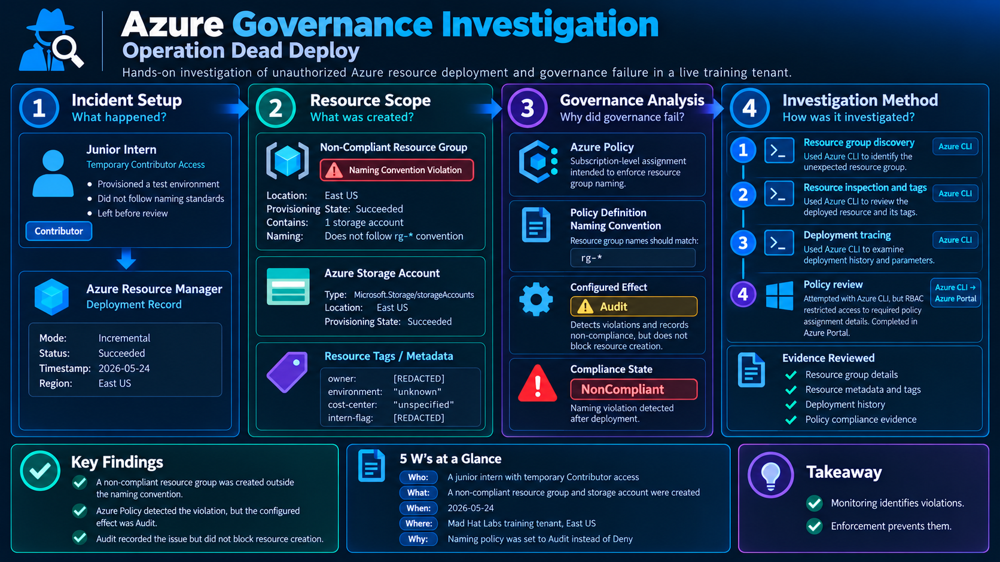
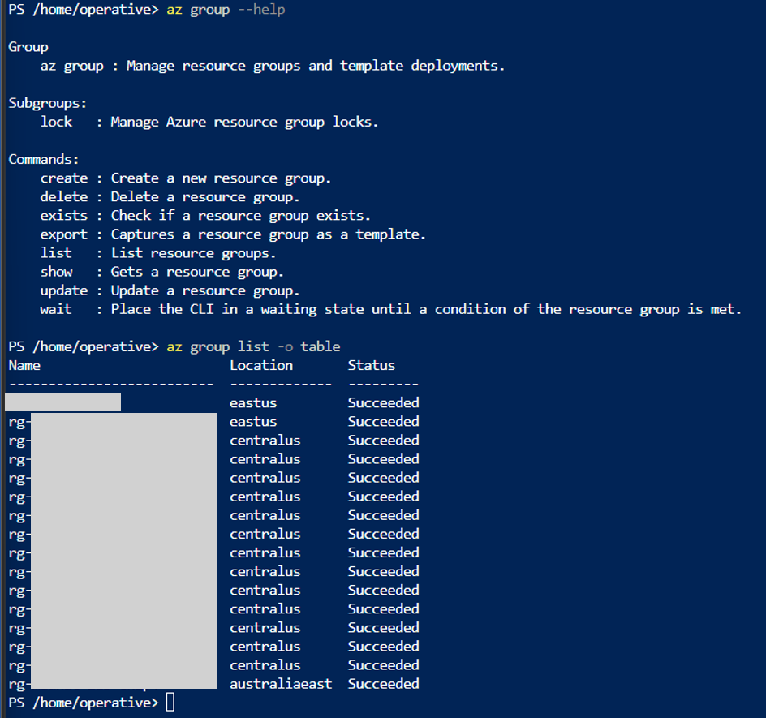
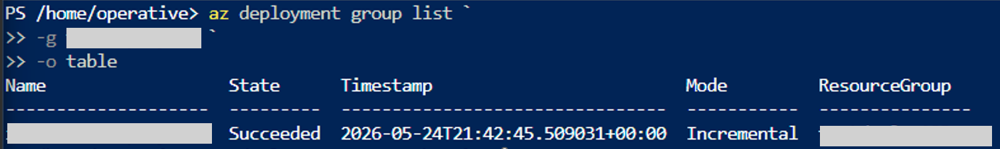
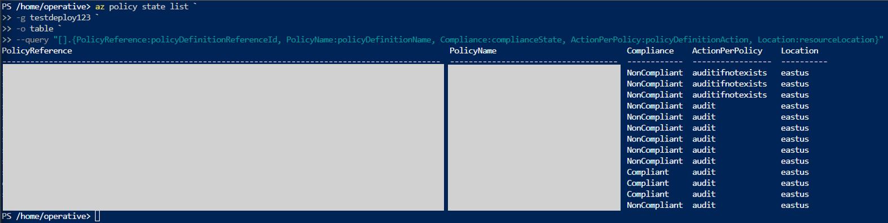
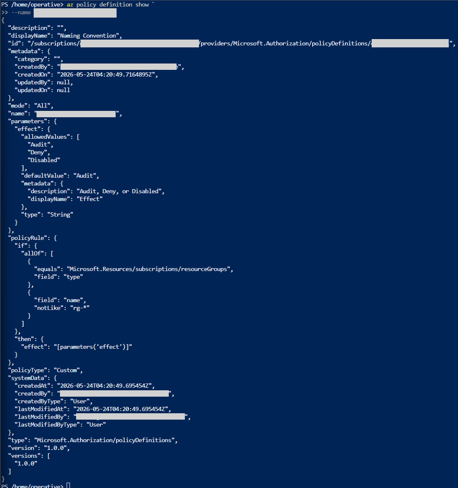
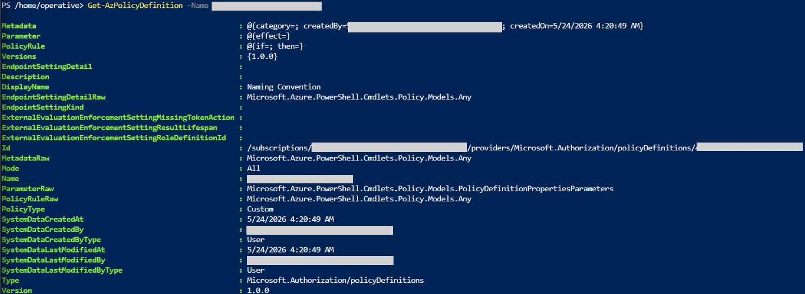
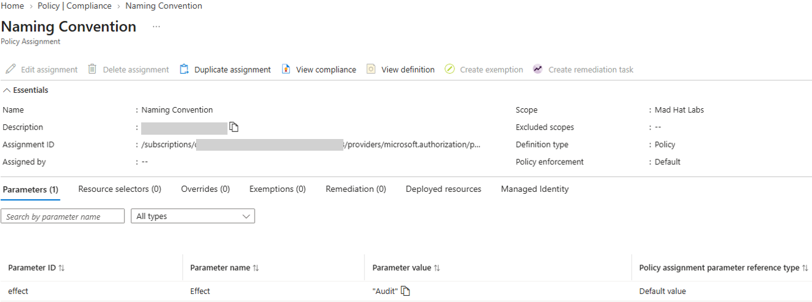

# Azure Governance Investigation
## Operation Dead Deploy

> Investigated a non-compliant Azure deployment in a **live multi-user Azure training tenant**, reconstructed the ARM deployment trail, and identified why an active naming policy detected the violation without preventing resource creation.



> **Scope note:** The architecture diagram represents only the identities, resources, deployment artifacts, and governance controls relevant to this investigation. Other resources in the shared training subscription are intentionally omitted.

---

## Executive Summary

This project documents a read-only Azure governance investigation performed in a live multi-user training tenant.

The lab itself was designed around the Azure Portal. I extended the exercise by using **Azure CLI as the primary investigation interface for Stages 1 through 3**:

1. identify the naming outlier,
2. inspect the deployed resource and its tags,
3. trace the ARM deployment.

For Stage 4, I continued with Azure CLI and successfully reached the policy state and custom policy definition. A direct request for the subscription-level policy assignment then failed with `AuthorizationFailed` for `Microsoft.Authorization/policyAssignments/read`. I completed the final assignment review in the **Azure Portal**, where the assignment showed an **Audit** effect.

The root cause was therefore not a failed Azure Policy engine. Azure Policy detected the violation, but the control was configured in **Audit** mode, which records non-compliance without blocking creation.

> **Environment disclosure:** This was a live multi-user Azure **training tenant**, not a production environment. Challenge answers and environment-specific identifiers are intentionally excluded from the public write-up.

---

## Scenario

A junior intern with temporary Contributor access provisioned a test environment that did not follow the expected resource-group naming convention.

My task was to determine:

- **Who** performed the provisioning?
- **What** was created?
- **When** did the deployment occur?
- **Where** was the resource deployed?
- **Why** did governance detect the violation but still allow the deployment?

The investigation was performed in **observe mode**. No resources were changed, remediated, or deleted.

---

## Environment

| Component | Details |
|---|---|
| Cloud platform | Microsoft Azure |
| Environment | Live multi-user Azure training tenant |
| Investigation access | Reader |
| Scenario provisioning access | Temporary Contributor |
| Primary investigation tool | Azure CLI |
| Stage 4 final review | Azure Portal |
| Secondary validation | Azure PowerShell |
| Provisioning evidence | Azure Resource Manager deployment history |
| Governance evidence | Azure Policy / Policy Insights |
| Investigation mode | Read-only |

---

# Investigation

## 1. Resource Group Discovery

I first reviewed the Azure CLI resource-group command family, then enumerated resource groups in the subscription.

```powershell
az group --help
az group list -o table
```

Most resource groups followed an `rg-` naming pattern. One resource group did not follow that pattern and became the investigation target.

>   

**What I concluded:** subscription-level inventory and naming-pattern analysis were sufficient to identify the outlier.

---

## 2. Resource Inspection and Tags

After identifying the suspicious resource group, I inspected the resources currently present in that group.

```powershell
az resource list `
  -g <RESOURCE_GROUP> `
  -o json
```

The output showed one resource:

- Type: `Microsoft.Storage/storageAccounts`
- Kind: `StorageV2`
- Location: `eastus`
- Provisioning state: `Succeeded`
- SKU: `Standard_LRS`

The same result also exposed the resource tags, including `cost-center`, `environment`, `intern-flag`, and `owner`.

>   

**What I concluded:** the resource group contained a single Azure Storage account, and the live resource metadata exposed the tags required for Stage 2.

---

## 3. ARM Deployment Reconstruction

I then moved from **current state** to **deployment history**.

### Deployment parameters

```powershell
az deployment group show `
  -g <RESOURCE_GROUP> `
  -n <DEPLOYMENT_NAME> `
  --query properties.parameters
```

The deployment parameters included:

- `internFlag`
- `location`
- `operativesGroupId`

>   

### Deployment history

```powershell
az deployment group list `
  -g <RESOURCE_GROUP> `
  -o table
```

The deployment record showed a successful **Incremental** deployment and provided the deployment timestamp.

>   

**What I concluded:** ARM deployment history provided a traceable provisioning record separate from the resource's current-state inventory.

---

## 4. Azure Policy State

Next, I queried policy evaluation data for the affected resource group.

```powershell
az policy state list `
  -g <RESOURCE_GROUP> `
  -o table `
  --query "[].{PolicyReference:policyDefinitionReferenceId, PolicyName:policyDefinitionName, Compliance:complianceState, ActionPerPolicy:policyDefinitionAction, Location:resourceLocation}"
```

The result contained multiple policy evaluations. The naming-policy record was `NonCompliant` with an effective action of `audit`.

>   

**What I concluded:** Azure Policy was evaluating the resource. The violation was being detected rather than ignored.

---

## 5. Naming Convention Policy Definition

I traced the relevant policy state to the custom policy definition.

```powershell
az policy definition show `
  --name <POLICY_DEFINITION_ID>
```

The JSON showed:

- `displayName`: `Naming Convention`
- `mode`: `All`
- `policyType`: `Custom`
- effect parameter allowed values: `Audit`, `Deny`, `Disabled`
- default effect value: `Audit`
- resource type condition: `Microsoft.Resources/subscriptions/resourceGroups`
- resource-group name condition: `notLike: "rg-*"`

>   

**What I concluded:** the custom policy definition was capable of detecting the resource-group naming violation.

---

## 6. Azure PowerShell Validation

Azure CLI remained my primary investigation interface, but I also validated the same policy definition with Azure PowerShell.

```powershell
Get-AzPolicyDefinition -Name <POLICY_DEFINITION_ID>
```

The PowerShell output confirmed:

- DisplayName: `Naming Convention`
- Mode: `All`
- PolicyType: `Custom`
- Version: `1.0.0`

>   

**What I concluded:** Azure PowerShell independently exposed the same policy definition, confirming the CLI finding.

---

## 7. Policy Assignment RBAC Boundary

The policy state led me to the subscription-level policy assignment, so I attempted to read it directly with Azure CLI.

```powershell
az policy assignment show `
  --name <POLICY_ASSIGNMENT_NAME>
```

The request failed with:

```text
AuthorizationFailed
Microsoft.Authorization/policyAssignments/read
```

>   

**What I concluded:** this was an RBAC authorization boundary, not a malformed Azure CLI command.

---

## 8. Policy Assignment Review in Azure Portal

Because the direct assignment read was blocked, I completed the final Stage 4 review in the Azure Portal.

The assignment view showed:

- Name: `Naming Convention`
- Scope: `Mad Hat Labs`
- Definition type: `Policy`
- Policy enforcement: `Default`
- Parameter name: `Effect`
- Parameter value: `Audit`

>   

**What I concluded:** the assignment was configured with an `Audit` effect.

---

# What Broke / What Surprised Me

The most useful troubleshooting lesson was that the Azure Portal made policy compliance feel like one workflow, while Azure CLI exposed separate Azure Policy objects that had to be correlated.

```text
Policy Definition
"What is the rule?"
        ↓
Policy Assignment
"Where and how is it applied?"
        ↓
Policy State
"What happened when Azure evaluated the resource?"
```

I could query policy state and read the custom policy definition, but a direct policy-assignment read failed because the Reader identity lacked:

```text
Microsoft.Authorization/policyAssignments/read
```

That forced me to distinguish between **visibility into compliance results** and **permission to read the underlying assignment object**.

---

# Findings and Recommendations

## Root Cause

> **Azure Policy detected the naming violation correctly. The deployment remained possible because the applicable policy effect was `Audit`, not the preventive `Deny` effect.**

| Effect | Result |
|---|---|
| `Audit` | Records non-compliance while allowing the request |
| `Deny` | Rejects the non-compliant request |

The policy engine was not broken. The governance control was configured for **detective monitoring** rather than **preventive enforcement**.

## Recommendations

| Priority | Recommendation | Reason |
|---|---|---|
| High | Evaluate changing the naming policy from `Audit` to `Deny` after testing | Converts the control from detective to preventive |
| High | Review the scope and duration of temporary Contributor access | Reduces unnecessary provisioning capability |
| Medium | Use time-bound elevated access where supported | Limits the exposure window for privileged roles |
| Medium | Document intentional Audit-mode exceptions | Prevents temporary monitoring configurations from becoming permanent |
| Medium | Monitor policy compliance continuously | Helps identify governance drift and recurring violations |

> A move from `Audit` to `Deny` should be tested before enforcement so legitimate workloads are not unexpectedly blocked.

---

# 5 W's at a Glance

| Question | Answer |
|---|---|
| **Who** | Junior intern with temporary Contributor access |
| **What** | A non-compliant resource group containing one Azure Storage account |
| **When** | Identified through the ARM deployment at 2026-05-24T21:42:45 |
| **Where** | Mad Hat Labs training subscription, resource located in East US |
| **Why** | The naming policy used `Audit`, which detected the violation but did not block creation |

---

# What I Learned

- Azure CLI can be used to move from resource discovery to deployment tracing and policy analysis.
- `az resource list` shows the resource's **current state**, while `az deployment group show` exposes **deployment-time inputs**.
- Azure Policy definitions, assignments, and policy states are separate objects.
- `Audit` is detective; `Deny` is preventive.
- JMESPath projections make large Azure CLI results easier to investigate.
- ARM deployment history provides useful control-plane evidence for reconstructing provisioning events.
- RBAC can allow policy-compliance visibility while restricting direct reads of the underlying policy assignment.
- Azure Portal views may aggregate data from several backend objects, so reproducing the same investigation through CLI can require multiple commands.

---

# Technical Drill-Down

For the deeper technical material:

- [Technical Analysis](docs/technical-analysis.md)
- [Azure CLI Commands](queries/azure-cli.md)
- [Azure PowerShell Commands](queries/azure-powershell.md)

---

# Tools and Services

- Microsoft Azure
- Azure CLI
- Azure PowerShell
- Azure Portal
- Azure Resource Manager
- Azure Policy
- Azure Policy Insights
- Azure RBAC
- JMESPath
- PowerShell

---

# Data Handling

This repository intentionally documents the **investigation method and reasoning**, not the course answer key.

The following are redacted from public screenshots:

- `MadHat{...}` challenge values
- Stage 1 resource-group answer
- Stage 3 deployment-name answer
- Stage 4 Description value
- usernames and email addresses
- operative identifiers
- tenant and subscription IDs
- object/group IDs
- policy-definition GUIDs
- policy-assignment GUIDs
- resource names and IDs where they expose environment-specific information

---

## Resume Line

> Investigated unexpected Azure resource provisioning in a live multi-user training tenant using Azure CLI, Azure PowerShell, ARM deployment history, and Azure Policy; traced a naming-control violation to an Audit-mode governance configuration that detected non-compliance without preventing deployment.