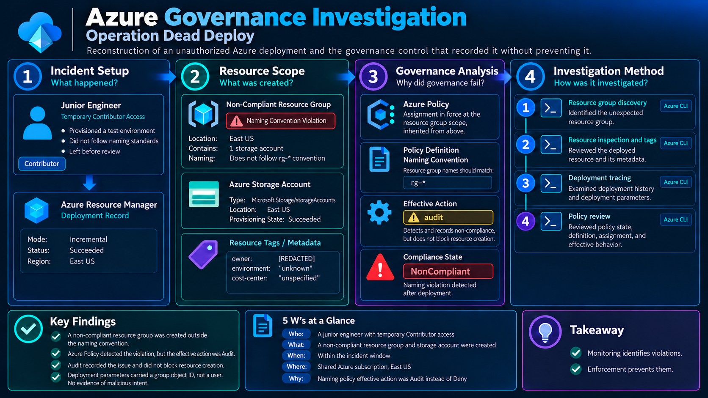
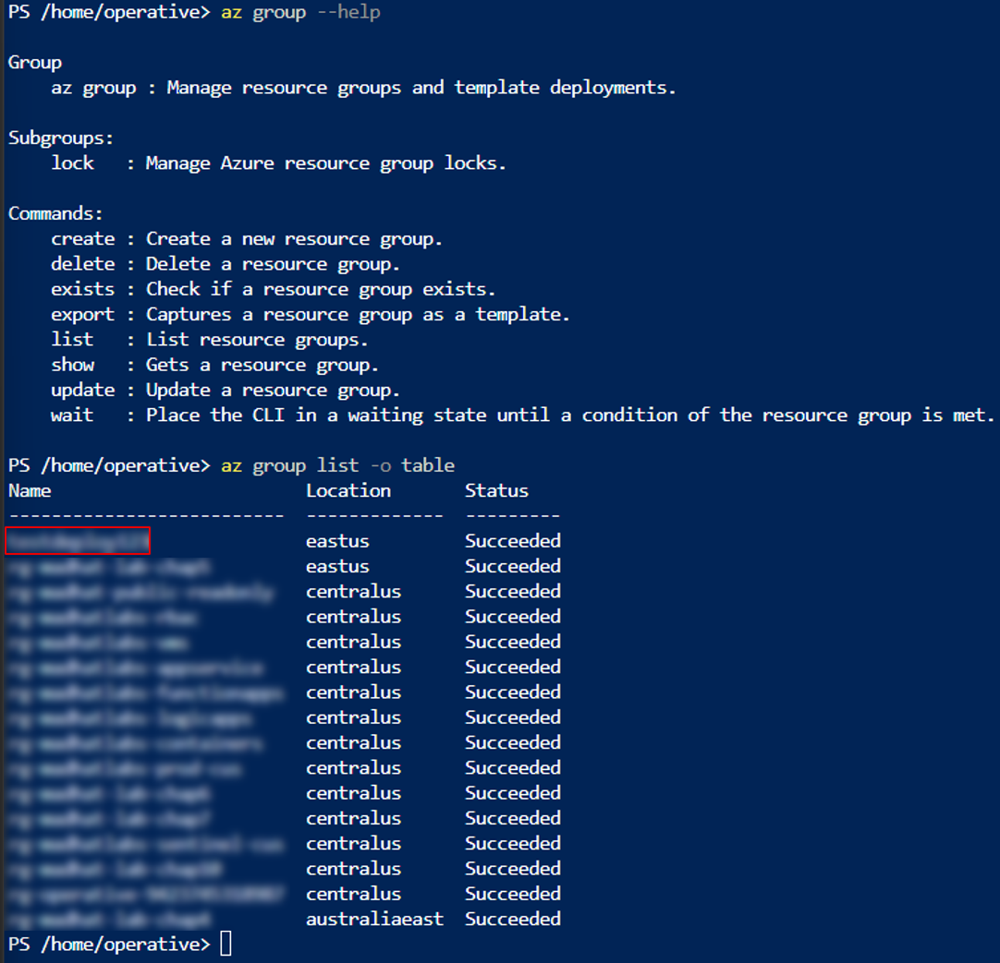
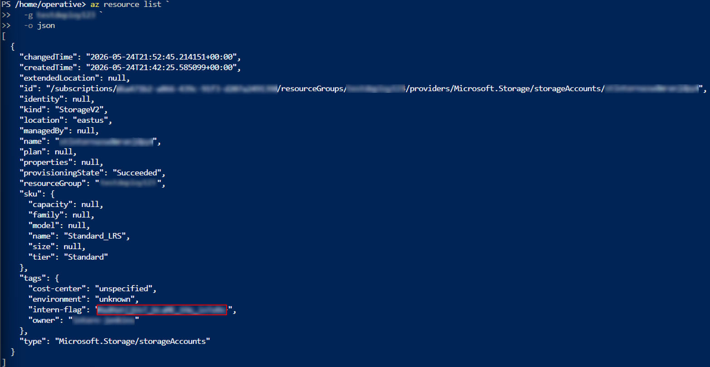
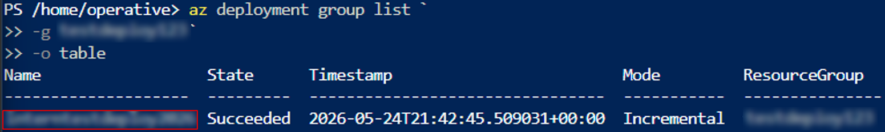
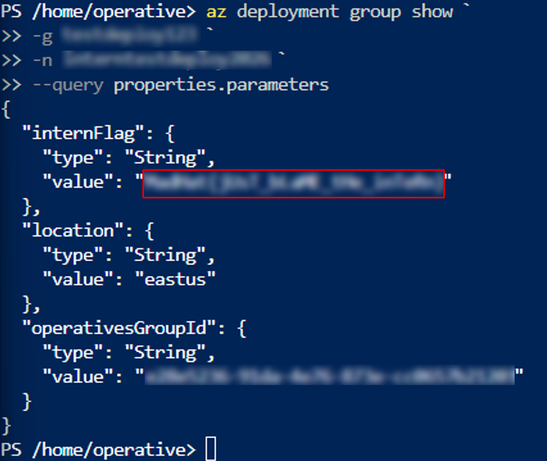
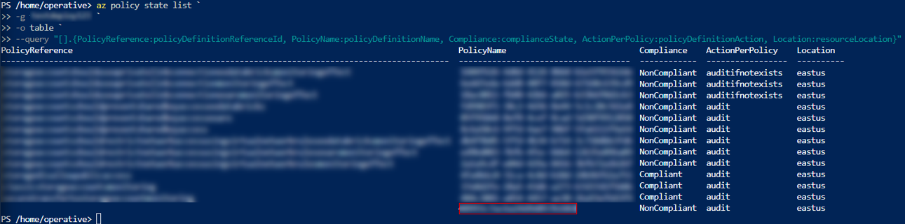
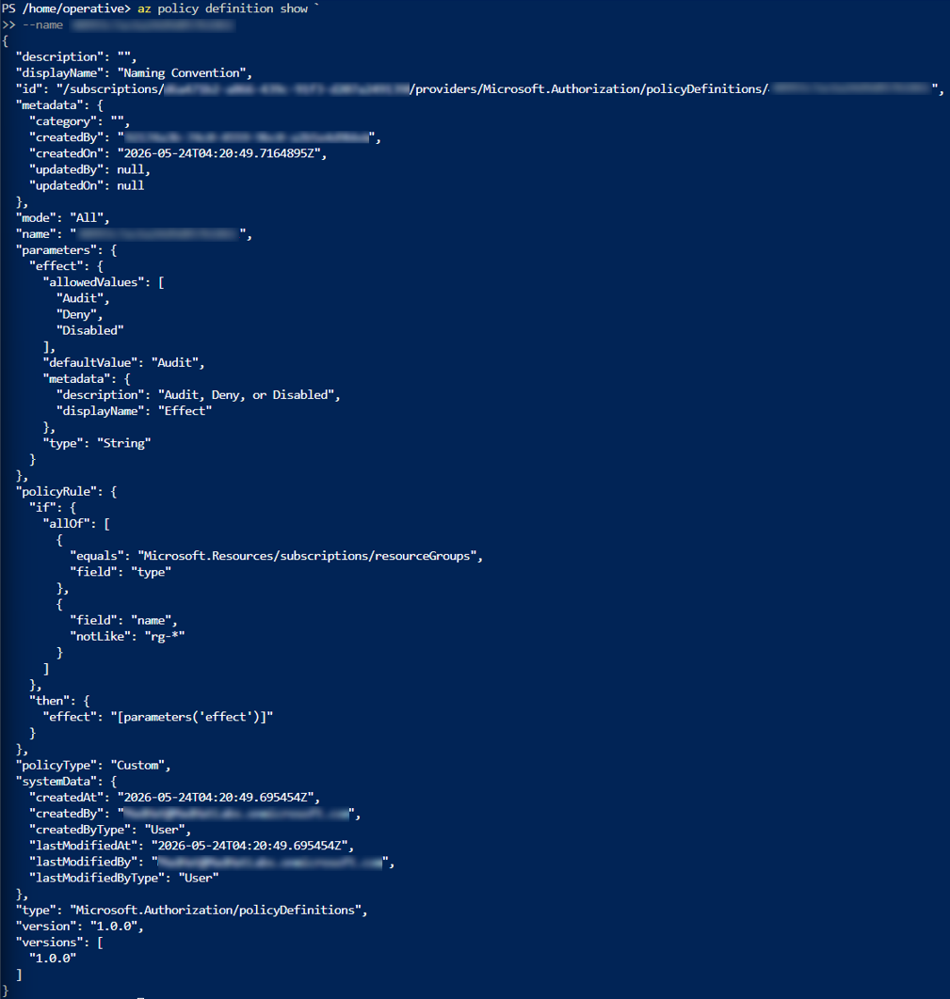
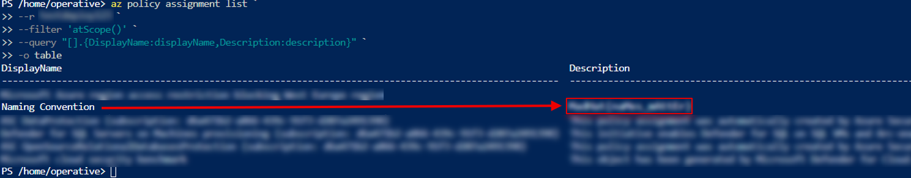

# Azure Governance Investigation
## Operation Dead Deploy

> Reconstructed an ARM deployment trail across a shared Azure subscription to determine why an active naming policy recorded a violation without preventing the resource from being created.



<p align="center">


</p>

<p align="center">


</p>

> **Scope note:** The architecture diagram represents only the identities, resources, deployment
> artifacts, and governance controls relevant to this investigation. Other resources in the shared
> subscription are intentionally omitted. This investigation was performed in a live multi-user Azure
> training tenant with Reader access, and is not presented as a production customer incident.

---

## Executive Summary

A resource group in a shared Azure subscription did not follow the subscription's naming convention.
Working read-only through Azure CLI, I enumerated the subscription inventory, inspected the single
storage account inside the outlier group, reconstructed the ARM deployment that created it, and
correlated three separate Azure Policy objects: the evaluation result, the rule, and the assignment
that applies the rule to a scope. The deployment succeeded, and Azure Policy recorded it as
non-compliant at the same time.

The root cause was not a failure of the policy engine. A custom policy definition named
`Naming Convention` matched the resource group correctly, and its effect parameter permits `Audit`,
`Deny`, and `Disabled` with `Audit` as the default value. The evaluation record returned by Policy
Insights showed the effective action taken against this resource group as `audit`. A detective effect
records non-compliance and allows the request to proceed.

The operationally important point is that every visible indicator looked healthy. The policy existed,
it was assigned, it evaluated, and it produced an accurate compliance record. From a dashboard, an
`Audit` control and a `Deny` control are indistinguishable until the effect in force at the scope is
read directly. Confirming that a control exists is not the same as confirming that it acts, and a
control in this state can sit in place indefinitely while the organisation believes a rule is being
enforced.

---

## Briefing

A junior engineer was granted temporary Contributor access to build a test environment. They were
unfamiliar with the governance standards in place, cut corners, deployed, and left. I came in
afterwards as the on-call Azure engineer, holding Reader across everything they had touched, and was
asked to assess what had been created, identify which governance control failed, and document the
evidence.

No resources, deployments, policies, or assignments were created, modified, or deleted.

---

## Environment

| Component | Details |
|---|---|
| Cloud platform | Microsoft Azure |
| Identity platform | Not exercised in this case |
| Environment | Shared multi-user Azure subscription |
| Access level | Read-only (Reader) |
| Provisioning access, per the briefing | Temporary Contributor |
| Investigation interface | Azure CLI |
| Query/filter language | JMESPath |
| Evidence source | Azure Resource Manager deployment history, Azure Policy Insights |

---

# Investigation

## 1. Resource Group Discovery

### Enumerate resource groups and identify the naming outlier

Unexplained provisioning surfaces first as a naming anomaly, and that comparison is made across the
whole subscription, so I enumerated resource groups and read them against the convention. I confirmed
the command family first to select the verb that returns the set rather than one named group.

```powershell
az group --help
```

```powershell
az group list -o table
```

> 
> *Highlighted: the resource group that does not follow the naming pattern. Redacted: all other
> resource group names in the subscription.*

Every resource group in the subscription except one began with the `rg-` prefix. The single outlier
carried no prefix, no environment indicator, and no region segment, and became the target for the rest
of the investigation.

---

## 2. Resource Inspection

### Inspect the resources and metadata inside the target group

Having identified the group, I needed to know what had actually been created inside it. I requested
full JSON rather than a table so that metadata attached at creation time was returned alongside the
resource properties.

```powershell
az resource list `
  -g <RESOURCE_GROUP> `
  -o json
```

> 
> *Informational: the tag block is highlighted although I was looking for storage information.
> Redacted: subscription ID, resource name and ID, the owner tag value, and the fourth tag value.*

The group held a single resource: a `StorageV2` storage account in `eastus`, SKU `Standard_LRS`, with a
provisioning state of `Succeeded`. Four tags were attached: `cost-center` set to `unspecified`,
`environment` set to `unknown`, an `owner` tag naming a user account, and a fourth tag carrying a
populated value. Two of the four tags held placeholder values, which is tagging that satisfies a
requirement without carrying ownership or lifecycle information.

---

## 3. Deployment Reconstruction

### List the deployment history for the resource group

Current-state inventory tells me what exists, not how it got there. Control-plane deployment records
are a separate object family, so I moved from the resource to its provisioning record.

```powershell
az deployment group list `
  -g <RESOURCE_GROUP> `
  -o table
```

> 
> *Highlighted: the deployment name. Redacted: the resource group name.*

One deployment record existed for this resource group. It was `Succeeded` and used `Incremental` mode,
which adds to whatever is already present rather than reconciling the group to the template. The
record supplied the deployment name needed to address the deployment directly.

### Read the parameters passed at deployment time

A deployment record names the event. The parameters are where the inputs supplied by whoever ran it
are preserved, so I projected directly to the parameters block.

```powershell
az deployment group show `
  -g <RESOURCE_GROUP> `
  -n <DEPLOYMENT_NAME> `
  --query properties.parameters
```

> 
>
> *Highlighted: the value of the third parameter. Redacted: that value, the resource group name, the deployment name, and the group object ID.*

Three parameters were passed at deployment time: `location`, set to `eastus`; `operativesGroupId`,
carrying a directory group object ID; and a third parameter carrying a populated string value. The
parameters record a group identifier, not a named user. This step establishes the inputs to the
deployment, and attribution to an individual rests on the `owner` tag from the previous step, not on
anything returned here.

---

## 4. Policy Evaluation

### Query policy evaluation state at the resource group scope

With the provisioning reconstructed, the remaining question was why governance allowed it. Policy
Insights holds evaluation results separately from both the resource and the deployment, and it records
what actually ran rather than what a policy is capable of, so I queried state at the resource group and
projected to the fields that identify a record and its outcome.

```powershell
az policy state list `
  -g <RESOURCE_GROUP> `
  -o table `
  --query "[].{PolicyReference:policyDefinitionReferenceId, PolicyName:policyDefinitionName, Compliance:complianceState, ActionPerPolicy:policyDefinitionAction, Location:resourceLocation}"
```

> 
> *Highlighted: the policy definition name on the record with no reference ID. Redacted: the policy definition GUIDs and the resource group name.*

Thirteen evaluation records returned. Twelve carried readable reference IDs. One record carried no reference ID at all, only a definition GUID, and was
`NonCompliant` with an effective action of `audit`. My projection could not name that policy, so it could not be attributed at this stage, and the GUID became the next lookup.

---

## 5. Policy Definition

### Resolve the unnamed evaluation record to its policy definition

The state record proved that something evaluated this resource group and found it non-compliant. It did
not say what rule was applied. A definition is addressed by name, so I used the GUID returned by the
previous step.

```powershell
az policy definition show `
  --name <POLICY_DEFINITION_ID>
```

> 
> *Informational: nothing is highlighted, as I was reading the full definition. Redacted: subscription ID, policy definition GUID, and the creator account identifiers in the metadata and systemData blocks.*

The definition resolved to a custom policy with the display name `Naming Convention`, `mode` of `All`,
and a rule matching resources of type `Microsoft.Resources/subscriptions/resourceGroups` whose `name`
is `notLike` `rg-*`. Its effect parameter permits `Audit`, `Deny`, and `Disabled`, with `Audit` as the
declared default value. This identified the rule behind the unnamed evaluation and showed that a
preventive effect was available to it and had not been selected.

---

## 6. Policy Assignment

### List the assignments in force at the resource group scope

A definition declares a rule; it does not apply one. I needed to confirm that this definition was
actually assigned over the resource group rather than merely present in the subscription. I used `list`
with the `atScope()` filter rather than `show`, because `show` addresses a single assignment at one
exact scope, while `atScope()` returns every assignment in force at the supplied scope including
assignments created higher up and inherited downward. Each assignment returns a large object, so I
projected to the two fields that identify it.

```powershell
az policy assignment list `
  -g <RESOURCE_GROUP> `
  --filter "atScope()" `
  --query "[].{DisplayName:displayName,Description:description}" `
  -o table
```

> 
> *Highlighted: the description value on the Naming Convention assignment. Redacted: that value under Naming Convention.*

Six assignments were in force at this scope, one of them `Naming Convention`. This confirmed the custom
definition was applied over this resource group and was therefore the rule producing the unattributed
`NonCompliant` record from policy state. My projection returned display name and description only, so
the assignment's own `Effect` parameter was not read from this command; the effect in force is
evidenced by `policyDefinitionAction` returning `audit` on the state record in the previous section.

---

# What Surprised Me

The finding that stood out was that nothing was broken. A non-compliant resource was created, a
governance control detected it, and the compliance record was written accurately. Every component
performed exactly as configured. The violation still reached a succeeded provisioning state, and the
control that caught it never had the authority to stop it. That gap is easy to miss from a compliance
view: a dashboard showing a policy as active and a resource as non-compliant looks like governance
working, and it is governance observing. An `Audit` control produces evidence, satisfies an audit
question about whether a policy exists, and generates a compliance signal, all without changing what
anyone is able to deploy.

The second surprise was that the most important evaluation in the result set was the one my output
could not identify. Twelve records carried readable policy references because they were evaluated as
members of an initiative. The standalone assignment that mattered returned a blank reference and a bare
GUID. A reviewer scanning that output for a recognisable policy name passes over the one record that
explains the case, and the blank reference field is the only thing marking it as worth resolving.

The third was how little the deployment record attributed. The parameters preserved a directory group
object ID and no user at all. A deployment record establishes that a provisioning event occurred and
what inputs it received; identifying the person behind it required a second object, and the only field
that named an account was a tag the provisioner set themselves. Tag-based ownership is self-reported
and carries no more authority than whoever typed it chose to give it.

---

# Findings and Recommendations

## Root Cause

> **Azure Policy detected the naming violation correctly. The deployment remained possible because the effective policy action at this scope was `Audit`, a detective effect, rather than the preventive `Deny` effect the definition also permits.**

No single object explains the outcome. The definition permitted prevention, the assignment placed the
rule over the scope, and the evaluation record shows which effect actually ran. Reading any one of the
three in isolation gives a misleading answer.

| Condition | Result |
|---|---|
| Custom definition matches resource groups not named `rg-*` | The violation is detectable |
| Definition permits `Audit`, `Deny`, `Disabled`, defaulting to `Audit` | Prevention is available but not selected by default |
| Assignment in force at the resource group scope | The rule is applied rather than dormant |
| Effective action on the evaluation record is `audit` | Non-compliance is recorded and the request proceeds |
| Temporary Contributor access held at provisioning time, per the briefing | The deployment was authorised to run |
| Tags accepted with placeholder values | Ownership metadata existed without carrying ownership |

## Recommendations

| Priority | Recommendation | Owner | Timeline | Reason |
|---|---|---|---|---|
| High | Move the `Naming Convention` assignment effect from `Audit` to `Deny` after a scoped test window, or record why `Audit` is intentional | Cloud Governance | 30 days | Converts a detective control into a preventive one, or makes the decision to keep it detective explicit |
| High | Audit every policy assignment in the subscription for effect value, not policy presence | Cloud Governance | 30 days | Identifies other controls believed to be enforcing while set to record |
| Medium | Bound temporary Contributor grants with an expiry and a named approver | Identity and Access | 60 days | Removes standing provisioning capability once the task is complete |
| Medium | Require `owner`, `environment`, and `cost-center` at deployment time and reject placeholder values | Platform Engineering | 60 days | Tags set to `unknown` and `unspecified` satisfy a tagging requirement while carrying nothing |
| Medium | Alert on `NonCompliant` evaluations where the effective action is `audit` | Platform Engineering | 90 days | Surfaces violations that no control will block |

> The tradeoff on the first recommendation is real: switching to `Deny` will reject legitimate
> deployments that do not match `rg-*`, including automation and existing pipelines that were never
> constrained before. The test window is what determines whether that cost is acceptable, and skipping
> it trades a governance gap for an outage.

---

# 5 W's at a Glance

| Question | Answer |
|---|---|
| **Who** | Per the briefing, a junior engineer holding temporary Contributor access. The deployment parameters carry a group object ID rather than a user, and the only evidence naming an account is the self-reported `owner` tag on the resource |
| **What** | A resource group breaching the naming convention, containing one `StorageV2` storage account |
| **When** | A single successful `Incremental` deployment, recorded in the resource group's ARM deployment history |
| **Where** | Shared Azure subscription, resource deployed to East US |
| **Why** | The effective action of the naming control at this scope was `Audit`, which records non-compliance and allows the request |

---

# What I Learned

- A policy that is present, assigned, and evaluating can still be incapable of preventing anything. Only the effect in force at the scope answers whether a control acts.
- Compliance state and effective action are two different fields on the same evaluation record, and reading only the first turns a governance gap into a reassuring dashboard.
- A reference ID is populated only for initiative members, so the standalone assignment that explains this case was the least identifiable record in the result. What a query cannot name, a reviewer will not pursue.
- A group object ID in a deployment parameter is not attribution, and tags set to `unknown` and `unspecified` are not ownership. Both satisfy the shape of a control while carrying none of its value.

---

# Technical Drill-Down

- [Technical Analysis](docs/technical-analysis.md) - Azure Policy object model, the definition to assignment to state chain, and full redaction detail
- [Azure CLI Commands](queries/azure-cli.md) - every command used, with the question each one answered
