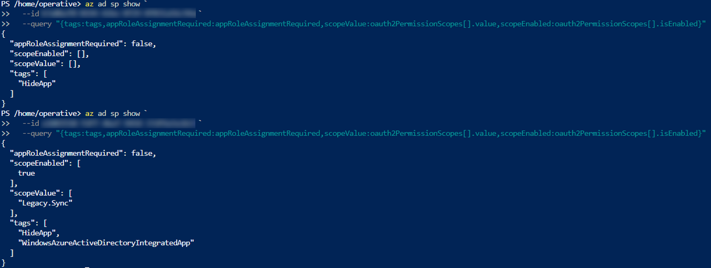
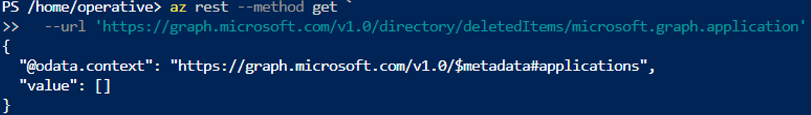

# Azure Identity Investigation
## The Stolen Identity

> Reconstructed a five-stage OAuth consent-phishing chain across two linked Microsoft Entra app registrations, tracing a stolen session into durable application-level persistence that standard containment would not remove.


<p align="center">


</p>

<p align="center">


</p>

> **Scope note:** The architecture diagram represents only the identities, application registrations, credentials, permissions, OAuth relationships, and redirect infrastructure relevant to this investigation. Other identities and resources in the shared tenant are intentionally omitted. This investigation was performed in a live multi-user Azure training tenant with Read-only directory application access, and is not presented as a production customer incident.

---

## Executive Summary

An attacker reached an Entra tenant through a stolen, MFA-satisfied user session and converted it into application-level access that no longer depended on the compromised user. Working read-only through Azure CLI, I reconstructed five stages on a flagged legacy app registration: a credential set to expire near the end of the century, a second application whose service principal had been added as an owner, a custom exposed API scope, an attacker-controlled redirect URI, and a persisted OAuth consent grant.

The root cause was identity and application governance drift. Ownership, credentials, permissions, and OAuth configuration on a legacy internal connector application were in a state where a single user compromise could anchor itself in application identities.

The chain rests entirely on object state. Directory audit and sign-in reporting were refused at the access held, so no action in the chain could be attributed to an authenticated caller and no timeline is claimed. What the configuration proves is the structure of the access, which is the part that survives containment.

Containment aimed at the user would not have closed it. Resetting the password, revoking sessions, and enforcing MFA leave the credential, the ownership relationship, the exposed scope, the redirect URI, and the consent grant untouched.

---

## Briefing

An attacker entered the tenant within the previous 24 hours. No exploit was used against a software vulnerability; access came through the identity plane, and no alerts were raised. The logs showed a sequence of ordinary sign-ins.

The task was to reconstruct what the attacker did, stage by stage, using only the available read access. Every step was reported to have left evidence on a single app registration the team had flagged as tampered with: `Mad-Hat-Legacy-Sync-Service`, a legacy internal connector application.

Read-only. No application registrations, credentials, permissions, scopes, owners, or redirect URIs were modified or deleted.

---

## Environment

| Component | Details |
|---|---|
| Cloud platform | Microsoft Azure |
| Identity platform | Microsoft Entra ID |
| Environment | Live multi-user Azure tenant |
| Access level | Read-only directory application access |
| Investigation interface | Azure CLI |
| Query/filter language | JMESPath |
| Evidence classes | Object state only. Event history was refused at the access held |
| Evidence source | Entra app registration and service principal objects |

---

# Investigation

## 1. Entry

### Enumerating app registrations

The briefing named the flagged application but gave no identifier, so I enumerated the tenant's app registrations to obtain it.

```powershell
az ad app list -o table
```

> 
> *Highlighted: `Mad-Hat-Legacy-Sync-Service` and its `AppId`.*

The inventory returned the flagged application and the identifier needed to inspect it.

### Inspecting the legacy application object

With the identifier in hand, I inspected the application object for configuration and for any properties carrying values beyond a default registration.

```powershell
az ad app show `
  --id <LEGACY-APP-ID> `
  --query "{isDeviceOnlyAuthSupported:isDeviceOnlyAuthSupported,isDisabled:isDisabled,isFallbackPublicClient:isFallbackPublicClient,keyCredentials:keyCredentials,nativeAuthenticationApisEnabled:nativeAuthenticationApisEnabled,notes:notes,optionalClaims:optionalClaims}" `
```

> 
> *Highlighted: the `notes` property. Redacted: the value of the `notes` property.*

The `notes` property was populated. A registration does not carry a value there by default, so the property establishes that the application was written to beyond its creation. The value was redacted, so this establishes that the field was populated, not what it said.

---

## 2. Escalate

### Reviewing application credentials

A stolen session expires. If the attacker intended to persist, a credential on the application is the mechanism that would outlast it, so I inspected the legacy application's password credentials.

```powershell
az ad app show `
  --id <LEGACY-APP-ID> `
  --query passwordCredentials
```

> 
> *Highlighted: the client secret's credential metadata, with an expiration set near the end of the century.*

One client secret was present, expiring near the end of the century. A credential with that lifetime authenticates the application indefinitely, and it does so without reference to any user session.

---

## 3. Pivot

### Re-enumerating app registrations

A secret can be rotated. That raised the question of whether anything else held control over the legacy application, so I re-enumerated the tenant's app registrations.

```powershell
az ad app list -o table
```

> 
> *Highlighted: `Mad-Hat-Labs-App` and its `AppId`.*

The inventory returned a second registration alongside the legacy application.

### Inspecting the second registration

I inspected that application object against the same projection used on the first, so the two could be compared field for field.

```powershell
az ad app show `
  --id <ROGUE-APP-ID> `
  --query "{isDeviceOnlyAuthSupported:isDeviceOnlyAuthSupported,isDisabled:isDisabled,isFallbackPublicClient:isFallbackPublicClient,keyCredentials:keyCredentials,nativeAuthenticationApisEnabled:nativeAuthenticationApisEnabled,notes:notes,optionalClaims:optionalClaims}" `
```

> 
> *Highlighted: the `notes` property on the second registration. Redacted: the value of the `notes` property.*

The second registration also carried a populated `notes` property, matching the pattern on the first. Two objects sharing an unusual populated field is suggestive, not conclusive. A configuration relationship between them would be.

### Querying application owners

An owner can modify the application it owns, including adding credentials. I queried the legacy application's Owners collection.

```powershell
az ad app owner list `
  --id <LEGACY-APP-ID> `
  --query "[].{Name:displayName,Id:id,CreatedDateTime:createdDateTime}" `
  -o table
```

> 
> *Highlighted: the `Mad-Hat-Labs-App` service principal listed as an owner of the legacy application.*

The owners list returned the second application's service principal. That is the configuration relationship the previous step could not establish, and it means control over the legacy application does not depend on the current secret. An owner can create another.

### Reviewing requested Graph permissions

Ownership matters in proportion to what the owned application can do, so I inspected the legacy application's requested resource access.

```powershell
az ad app show `
  --id <LEGACY-APP-ID> `
  --query requiredResourceAccess
```

> 
> *Highlighted: two Microsoft Graph `resourceAccess` entries of `"type": "Role"`.*

Both entries were `"type": "Role"`, which identifies them as application permissions rather than delegated user scopes. They carried GUIDs rather than names.

### Resolving the first permission identifier

Permission names live on the resource's service principal, so I resolved each GUID against Microsoft Graph's `appRoles` collection.

```powershell
az ad sp show `
  --id 00000003-0000-0000-c000-000000000000 `
  --query "appRoles[?id=='<PERMISSION-ID>']" `
  -o table
```

> 
> *Highlighted: the first identifier resolves to `Directory.Read.All`.*

The first entry resolved to a directory-wide read permission.

### Resolving the second permission identifier

I repeated the resolution for the second identifier.

```powershell
az ad sp show `
  --id 00000003-0000-0000-c000-000000000000 `
  --query "appRoles[?id=='<PERMISSION-ID>']" `
  -o table
```

> 
> *Highlighted: the second identifier resolves to a directory-wide user permission.*

Both permissions belong to the application identity and run without a user session. With ownership of this application, the attacker held directory-level reach.

---

## 4. Persist

### Reviewing exposed API configuration

Two access paths were established: the credential and the ownership relationship. Both are removable by an administrator who finds them. I checked whether the legacy application exposed anything that would create a third.

```powershell
az ad app show `
  --id <LEGACY-APP-ID> `
  --query api
```

> 
> *Highlighted: an enabled custom delegated scope, `Legacy.Sync`, published under the legacy application's API configuration.*

The legacy application publishes a custom scope. Another application can request delegated access to it through user consent, giving the attacker a third path that credential rotation does not touch.

---

## 5. Loot

### Reviewing redirect URI configuration

A published scope is only useful if something requests it and the authorization response reaches infrastructure the attacker controls. I inspected the rogue application's web configuration.

```powershell
az ad app show `
  --id <ROGUE-APP-ID> `
  --query web
```

> 
> *Highlighted: a redirect URI that does not match the standard local-development pattern present alongside it.*

Two redirect URIs were configured. One was a normal local-development callback. The other pointed outside the tenant, and that is where authorization codes issued to this application land.

### Comparing service principal configuration across both applications

The app registration and its service principal are separate objects, and configuration governing how an application presents to users lives on the second. I projected the same fields on both applications so they could be read against each other.

```powershell
az ad sp show `
  --id <ROGUE-APP-ID> `
  --query "{tags:tags,appRoleAssignmentRequired:appRoleAssignmentRequired,scopeValue:oauth2PermissionScopes[].value,scopeEnabled:oauth2PermissionScopes[].isEnabled}"
```

> 
> *Highlighted: the `HideApp` tag on both service principals, and the empty scope collection on the rogue application. Redacted: nothing in this projection is environment-specific.*

Both service principals carry the `HideApp` tag, which removes an application from the MyApps portal. A user who consents does not see the application among their connected applications, and MyApps is the self-service path for revoking a grant. The rogue application's scope collection is empty, which establishes it as a consumer of the legacy application's scope rather than a publisher of its own.

### Executing the consent flow

Configuration alone does not prove what the flow produces. I executed the authorization request against my own operative account to demonstrate the path end to end.

> 
> *Highlighted: the rogue application requesting delegated access to the legacy application's exposed API.*

The request surfaced as a consent prompt naming the rogue application and the scope it was asking for.

### Approving the consent request

The flow required explicit approval before the delegated permission could be issued.

> 
> *Highlighted: the approval step required before the requested delegated permission is granted.*

No authentication was requested at any point. The account was already signed in, and the only action required was approval.

### Querying OAuth permission grants

A consent screen is a browser event. Whether it wrote a durable object was a separate question, so I queried the grants held by the rogue application.

```powershell
az ad app permission list-grants `
  --id <ROGUE-APP-ID> `
  --show-resource-name true `
  -o json
```

> 
> *Highlighted: `consentType: Principal`, resource `Mad-Hat-Legacy-Sync-Service`, scope `Legacy.Sync`.*

The consent wrote an `OAuth2PermissionGrant` into the directory, with a `consentType` of `Principal`, meaning one user consented for themselves. It outlived the browser session that created it.

### Capturing the authorization response

With the grant in place, I confirmed where the resulting authorization response was delivered.

> 
> *Highlighted: the configured callback receiving the authorization response.*

The configured redirect URI received the response. The delivery path works.

### Decoding the callback value

The response carried URL-encoded data, so I decoded it to inspect the value in readable form.

> 
> *Highlighted: the decoded value carried in the callback, redacted.*

Consent wrote a persistent delegated grant into the directory, and the redirect URI sent the resulting authorization response outside the tenant. The flow required no authentication from the victim, only approval, which is why it produces no suspicious sign-in. This is a **confused deputy** pattern: a trusted application acting on a request it should never have authorized. Nothing in the chain is a vulnerability. Every component behaves as designed.

---

## 6. Attribution Boundary

### Querying directory audit logs for the configuration changes

Every artifact in the chain is a configuration change, and each one is recorded as a directory audit event naming the principal that made it. I queried the audit log to establish who created the registrations, added the credential, assigned the owner, and consented.

```powershell
az rest --method get `
  --url 'https://graph.microsoft.com/v1.0/auditLogs/directoryAudits?$top=10'
```

> 
> *Highlighted: the HTTP 403 error code and message. Redacted: the request and client request identifiers.*

The endpoint returned HTTP 403 with `Authentication_RequestFromUnsupportedUserRole`. Reading directory audit and sign-in reporting requires a role granting access to reporting endpoints, and the access held for this investigation did not include one. Four activity-filtered queries for application creation, credential addition, owner assignment, and consent were refused identically, as was the sign-in log.

### Separating a permissions boundary from an empty result

A refusal on one endpoint family does not establish whether the data exists. I queried a directory endpoint reachable at the same access level to establish which of the two the refusal represented.

```powershell
az rest --method get `
  --url 'https://graph.microsoft.com/v1.0/directory/deletedItems/microsoft.graph.application'
```

> 
> *Highlighted: HTTP 200 with an empty `value` array. Redacted: nothing in this output is environment-specific.*

The same access that was refused on reporting endpoints answered on a directory endpoint and returned an empty array. No soft-deleted application objects exist in the recovery window, which rules out a removed registration as a further artifact, and it establishes that the audit refusals are a property of the role held rather than of the tenant.

---

# What Surprised Me

How quickly the attack stopped depending on the person who was phished. The stolen session lasted one stage. By the third, an ownership relationship existed that could mint fresh credentials on demand, and the original account was incidental. Containing the human identity would have contained the least durable part of the intrusion.

The ownership relationship is the finding most likely to be missed. A privileged-access review that enumerates directory roles returns nothing here, because nobody was granted a role. A service principal was made an owner of an application, which is administrative capability sitting in a place administrative capability is not normally looked for. Ownership is also enumerated per application rather than per identity, so there is no single view that answers what a given service principal owns.

The consent grant was the second. A consent prompt presents as a user-interface event and is easy to treat as one. It writes a durable authorization object that outlives the browser session, the password, and the MFA method that authorized it. Five artifacts persist independently of the user account, and a containment playbook aimed at the account closes none of them.

The third was a default. In Entra ID, any standard user can register an application, and whoever registers it becomes its owner automatically. The attacker did not need elevated privilege to create the second application or to own it. That capability was already granted to every user in the tenant, and it is the precondition for the entire pivot stage.

---

# Findings and Recommendations

## Root Cause

> **An application ownership relationship and excessive trust in a legacy Entra application allowed a compromised user session to expand into durable application-level persistence and OAuth token harvesting.**

No single control explains the incident. It exists in the relationship between identities, applications, credentials, permissions, ownership, and consent.

| Condition | Result |
|---|---|
| MFA completed by the victim, per the briefing | The stolen session carried an MFA-satisfied claim |
| A legacy internal connector application, per the briefing | The affected application was trusted and carried standing permissions |
| Service principal held as owner of the application | Control over application configuration, including the ability to create credentials |
| Long-lived client secret | Durable application authentication independent of any user session |
| Broad Graph application permissions | Directory-wide read exercised by the application identity |
| Custom exposed API scope | A consent-based access path not reached by credential rotation |
| Service principal tagged `HideApp` | The application is absent from the consenting user's MyApps portal |
| Attacker-controlled redirect URI | Authorization responses delivered outside the tenant |
| Persisted OAuth permission grant | Delegated authorization surviving the consent interaction |

## Recommendations

| Priority | Recommendation | Owner | Timeline | Reason |
|---|---|---|---|---|
| High | Revoke the client secret on the legacy application | Identity and Access | 30 days | Removes the client-secret persistence mechanism |
| High | Remove the service principal from the legacy application's Owners collection | Identity and Access | 30 days | Removes the ability to create a replacement credential |
| High | Revoke the `OAuth2PermissionGrant` held by the rogue application against the legacy application's scope | Identity and Access | 30 days | User containment does not remove delegated grants |
| High | Remove the redirect URI resolving outside the tenant from the rogue application | Application Owner | 30 days | Stops authorization responses reaching external infrastructure |
| High | Remove the custom exposed scope from the legacy application | Application Owner | 30 days | Eliminates the consent-based access path |
| High | Reduce the legacy application's Microsoft Graph application permissions to those its function requires | Identity and Access | 30 days | Limits the directory-wide read exercised by the application identity |
| High | Restrict application registration to an approved group rather than all users | Cloud Governance | 30 days | Removes the precondition for the pivot stage |
| Medium | Grant a role permitting directory audit and sign-in reporting to the identity response function | Security Operations | 60 days | Configuration changes could not be attributed during this investigation because reporting endpoints were refused |
| Medium | Recertify app-registration and service-principal Owners collections on a quarterly cycle | Identity and Access | 60 days | Ownership is administrative capability outside the scope of a directory role review |
| Medium | Alert on client secrets and certificates added to app registrations | Security Operations | 60 days | Detects credential-based persistence |
| Medium | Alert on owner additions to applications and service principals | Security Operations | 60 days | Detects control-path persistence |
| Medium | Alert on redirect URI changes, new exposed scopes, and new consent grants | Security Operations | 60 days | Detects the OAuth configuration this chain depended on |

> Restricting application registration carries a real cost. Self-service registration is how developers prototype, and routing it through an approval queue turns a task that took seconds into a ticket, with the usual consequence that people find another way. The defensible version pairs the restriction with a named approver and a turnaround commitment. Leaving registration open and monitoring ownership changes instead is a coherent alternative; leaving it open and monitoring nothing is the current state.

> Identity incident response has to contain the compromised human identity **and** the affected application identities, credentials, ownership relationships, consent grants, scopes, and redirect URIs. Closing the account and stopping there reports the incident contained while five access paths remain open.

---

# 5 W's at a Glance

| Question | Answer |
|---|---|
| **Who** | Per the briefing, a phished user provided the foothold. No action in the chain could be attributed to an authenticated principal, because directory audit and sign-in reporting were refused at the access held |
| **What** | A five-stage OAuth consent-phishing chain ending in a persisted delegated grant |
| **When** | Per the briefing, within the previous 24 hours. Event history was unavailable, so no time is established from evidence |
| **Where** | Microsoft Entra ID, across `Mad-Hat-Legacy-Sync-Service` and `Mad-Hat-Labs-App` |
| **Why** | An ownership relationship, broad application permissions, a long-lived credential, and unreviewed OAuth configuration together created access that does not depend on the compromised user |

---

# What I Learned

- Application ownership is a shadow administrative path. It will not appear in a review of privileged directory roles, because no role was assigned.
- Application permissions are exercised by the application identity, so they survive containment aimed at the user and are not subject to Conditional Access.
- Exposed API scopes and redirect URIs are security configuration, not developer settings. The redirect URI determines where authorization codes are delivered.
- Consent grants persist as directory objects and require explicit revocation. Password resets, session revocation, and MFA enforcement do not remove them.
- A configuration chain can be reconstructed in full from object state while remaining unattributable. Proving how access was structured and proving who structured it require different evidence and different access.

---

# Technical Drill-Down

- [Technical Analysis](docs/technical-analysis.md) - Entra and OAuth mechanics, permission resolution, evidence classes, access dependencies, attack chain, detection opportunities
- [Azure CLI Commands](queries/azure-cli.md) - every command used, with the question each one answered
