# Azure Identity Investigation
## The Stolen Identity

> Reconstructed a five-stage OAuth consent-phishing and application-persistence chain in a **live multi-user Azure training tenant**, tracing the attack across two linked Microsoft Entra app registrations with Azure CLI.

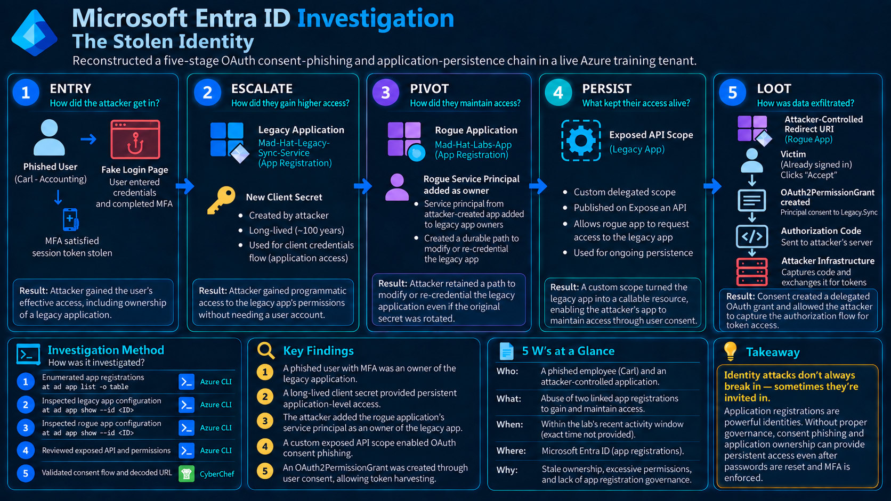

> **Scope note:** The architecture diagram represents only the identities, application registrations, credentials, permissions, OAuth relationships, and redirect infrastructure relevant to this investigation. Other identities and resources in the shared training tenant are intentionally omitted.

---

## Executive Summary

This project documents a read-only Microsoft Entra ID investigation performed in a live multi-user Azure training tenant.

The lab itself was designed around the Azure Portal. I extended the investigation by using **Azure CLI as the primary investigation interface** to enumerate app registrations, inspect both applications involved in the incident, validate the ownership relationship between them, review application permissions and credentials, and confirm the OAuth grant created during the consent flow.

The investigation reconstructed five stages:

1. **Entry** - a phished user completed MFA and the resulting authenticated session was stolen.
2. **Escalate** - ownership of a legacy application was abused to establish long-lived application credentials.
3. **Pivot** - an attacker-created application's service principal was added as an owner of the legacy application, creating a durable path back into an application with powerful Microsoft Graph permissions.
4. **Persist** - a custom delegated API scope created an additional OAuth access path.
5. **Loot** - an attacker-controlled redirect URI and user consent produced an OAuth permission grant and authorization flow capable of delivering access to attacker-controlled infrastructure.

The investigation showed that the incident stopped being only a compromised-user problem once the attacker began abusing application identities. Password resets, session revocation, and stronger MFA would not automatically remove application credentials, ownership relationships, exposed API scopes, redirect URIs, or OAuth consent grants.

The root cause was **identity and application governance drift**: stale ownership, excessive application permissions, long-lived credentials, and unreviewed OAuth configuration allowed a user-session compromise to become durable application-level persistence.

> **Environment disclosure:** This was a live multi-user Azure **training tenant**, not a production environment. Challenge answers and environment-specific identifiers are intentionally excluded from the public write-up.

---

## Scenario

The incident briefing stated that an attacker had entered the tenant within the previous 24 hours without exploiting a software vulnerability. The initial foothold came through the identity plane.

A user was phished by a fraudulent sign-in page and completed MFA. The attacker obtained the authenticated session created after MFA had been satisfied. The compromised user had also been left as an owner of a legacy internal connector application, `Mad-Hat-Legacy-Sync-Service`.

That stale ownership relationship gave the attacker a path from a compromised human identity into an application identity with significantly greater capability.

My task was to determine:

- **Who** provided the initial foothold and which application identities became involved?
- **What** application configuration enabled escalation, persistence, and token harvesting?
- **When** did the attack occur relative to the incident window?
- **Where** did the attack artifacts exist across the legacy and rogue app registrations?
- **Why** would normal user-focused containment fail to completely remove the attacker's access?

The investigation was performed in **observe mode**. No application registrations, credentials, permissions, scopes, owners, or redirect URIs were modified or deleted.

---

## Environment

| Component | Details |
|---|---|
| Cloud platform | Microsoft Azure |
| Identity platform | Microsoft Entra ID |
| Environment | Live multi-user Azure training tenant |
| Investigation access | Read-only directory application access |
| Primary investigation tool | Azure CLI |
| Query/filter language | JMESPath |
| Primary evidence source | Microsoft Entra app registration and service principal objects |
| Supporting validation | Microsoft OAuth consent flow |
| URL decoding | CyberChef |
| Applications investigated | `Mad-Hat-Legacy-Sync-Service` and `Mad-Hat-Labs-App` |
| Investigation mode | Read-only |

---

# Investigation

## 1. Entry - Compromised Session and Legacy Application

I first enumerated the tenant's app registrations to locate the legacy application identified in the incident briefing.

```powershell
az ad app list -o table
```

The application inventory exposed `Mad-Hat-Legacy-Sync-Service` and provided the application identifier needed for deeper inspection.

> 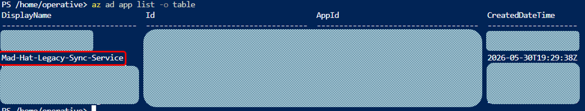
> *Context: Application enumeration identified `Mad-Hat-Legacy-Sync-Service` and provided the `AppId` needed for deeper inspection.*

I then inspected the legacy application object and reviewed its internal notes metadata.

```powershell
az ad app show `
  --id <LEGACY-APP-ID> `
  --query "{isDeviceOnlyAuthSupported:isDeviceOnlyAuthSupported,isDisabled:isDisabled,isFallbackPublicClient:isFallbackPublicClient,keyCredentials:keyCredentials,nativeAuthenticationApisEnabled:nativeAuthenticationApisEnabled,notes:notes,optionalClaims:optionalClaims}" `
```

The notes documented that the initial compromise began with a phished user and an authenticated session obtained after MFA had already been satisfied.

> 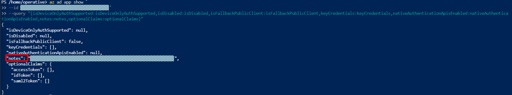
> 
> *Highlighted: the `notes` metadata documents the initial access method associated with the compromised user session.*

**What I concluded:** the attacker did not begin by compromising an Azure resource. The foothold originated from a human identity, and stale ownership of the legacy application turned that user-session compromise into an application-security incident.

---

## 2. Escalate - Long-Lived Client Secret

I inspected the legacy application's password credentials.

```powershell
az ad app show `
  --id <LEGACY-APP-ID> `
  --query passwordCredentials
```

The credential metadata showed a client secret with an expiration date set near the end of the century.

> 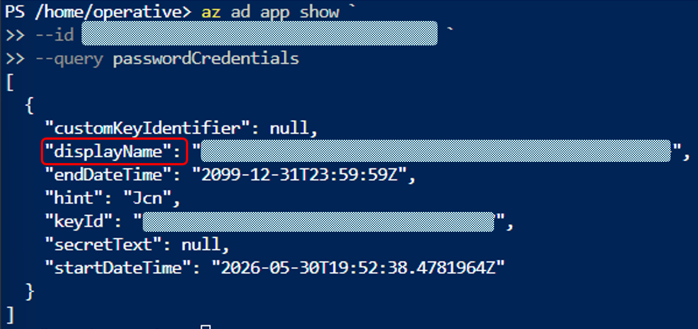
> *Highlighted: the `credential metadata` identifies the suspicious client secret, while the 2099 expiration date indicates an effectively long-lived application credential.*

Creating a client secret changed the nature of the compromise. The attacker no longer needed to repeatedly authenticate as the phished user. The application could authenticate programmatically as its service principal through the client credentials flow.

**What I concluded:** the attacker converted temporary access derived from a compromised user session into durable application-level authentication.

---

## 3. Pivot - Rogue Application, Ownership, and Privilege

A single client secret could eventually be discovered and rotated, so the attacker introduced a second application registration.

I enumerated the app registrations again to identify the attacker-created application, `Mad-Hat-Labs-App`.

```powershell
az ad app list -o table
```

> 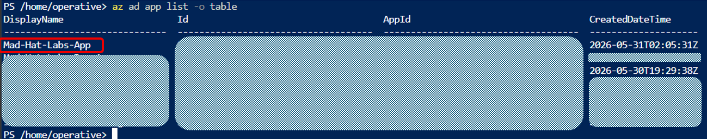
> *Context: Application enumeration identified `Mad-Hat-Labs-App` and provided the `AppId` needed for deeper inspection.*

I then inspected the rogue application object and its metadata.

```powershell
az ad app show `
  --id <ROGUE-APP-ID> `
  --query "{isDeviceOnlyAuthSupported:isDeviceOnlyAuthSupported,isDisabled:isDisabled,isFallbackPublicClient:isFallbackPublicClient,keyCredentials:keyCredentials,nativeAuthenticationApisEnabled:nativeAuthenticationApisEnabled,notes:notes,optionalClaims:optionalClaims}" `
```

The rogue application's metadata tied it to the persistence chain.

> 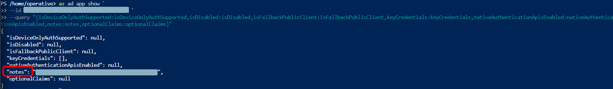
> 
> *Highlighted: the rogue application's `notes metadata` associates the application with the persistence activity under investigation.*

### Ownership Relationship

I queried the **Owners** collection of the legacy application.

```powershell
az ad app owner list `
  --id <LEGACY-APP-ID> `
  --query "[].{Name:displayName,Id:id,CreatedDateTime:createdDateTime}" `
  -o table
```

The result showed the `Mad-Hat-Labs-App` service principal as an owner of the legacy application.

> 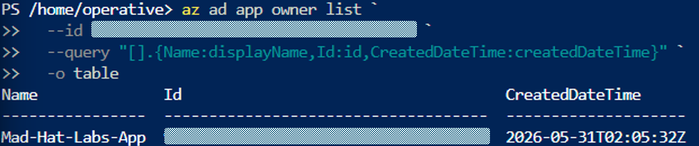
> *Evidence: The legacy application's Owners collection identified `Mad-Hat-Labs-App` as an owner, establishing a direct ownership relationship between the rogue and legacy applications.*

This was the direct evidence connecting the attacker-created application to the legacy application. The relationship meant the attacker did not have to depend on one client secret indefinitely; control through application ownership provided a path to modify the legacy application and establish new credentials.

### Supporting Permission Evidence

I also inspected the legacy application's requested resource access to understand why control of the application mattered.

```powershell
az ad app show `
  --id <LEGACY-APP-ID> `
  --query requiredResourceAccess
```

> 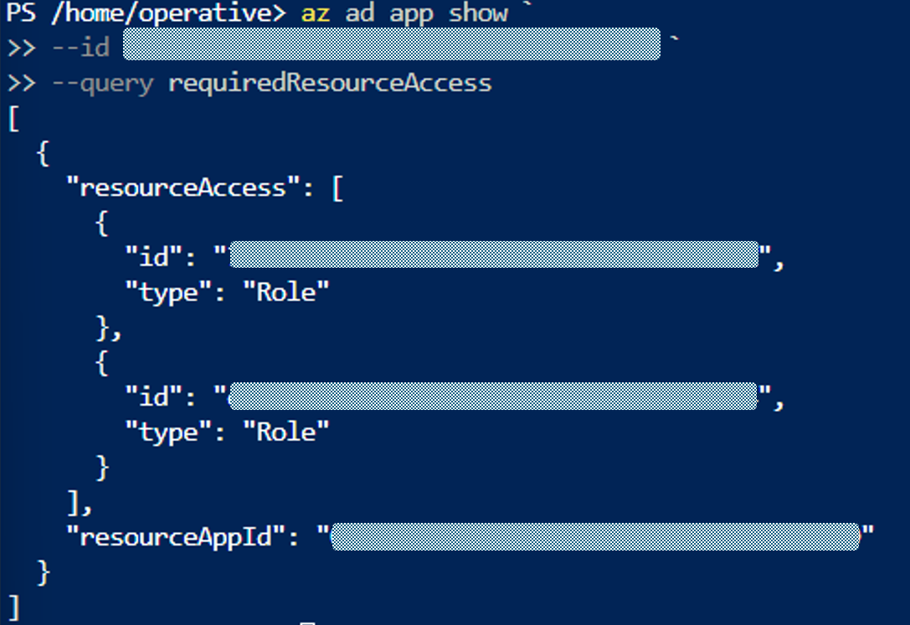
> *Evidence: The legacy application's requested resource access contained Microsoft Graph entries of type `Role`, indicating application permissions rather than delegated user scopes.*

The output showed Microsoft Graph as the target resource and two `resourceAccess` entries with:

```json
"type": "Role"
```

In this context, `Role` represents a Microsoft Graph **application permission**, not a user or Entra directory-role assignment.

To resolve the permission GUIDs into human-readable names, I queried the Microsoft Graph service principal's `appRoles` collection.

```powershell
az ad sp show `
  --id <RESOURCE-APP-ID> `
  --query "appRoles[?id=='<PERMISSION-ID>']" `
  -o table
```

The first permission resolved to `Directory.Read.All`.

> 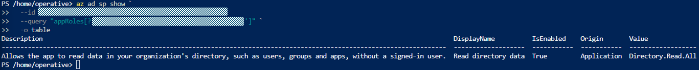
> *Validation: Resolving the first Microsoft Graph app-role identifier confirmed the `Directory.Read.All` application permission.*

The second permission resolved to `User.Read.All`.

> 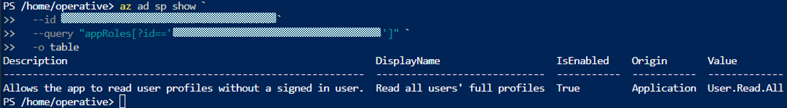
> *Validation: Resolving the second Microsoft Graph app-role identifier confirmed the `User.Read.All` application permission.*

The legacy application therefore requested these Microsoft Graph application permissions:

- `Directory.Read.All`
- `User.Read.All`

Resolving the GUIDs directly against Microsoft Graph confirmed that both entries were **application permissions** assigned to an application identity rather than delegated user scopes.

These permissions increased the potential blast radius because the legacy application could perform directory reads independently of the originally compromised user's interactive session.

**What I concluded:** the attacker-created application's service principal was explicitly assigned as an owner of the legacy application, creating a persistence path that could survive rotation of the original secret while preserving control of an application with broad Microsoft Graph directory-read permissions.

---

## 4. Persist - Custom Exposed API Scope

I returned to the legacy application and inspected its API configuration.

```powershell
az ad app show `
  --id <LEGACY-APP-ID> `
  --query api
```

The `oauth2PermissionScopes` collection contained a custom delegated scope published by the legacy application.

> 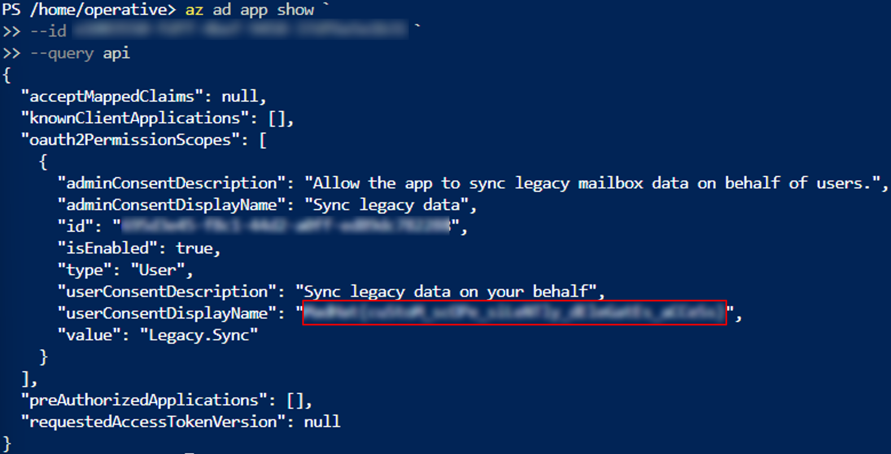
> *Highlighted: the legacy application's API configuration contains an enabled custom delegated scope, `Legacy.Sync`, establishing an additional OAuth access path.*

Publishing an API scope allows another application to request delegated access to the legacy application as a protected resource.

That created a second persistence path that did not depend entirely on the original client secret.

**What I concluded:** the attacker established an OAuth-based backup path that could remain useful even if the original application credential was discovered and removed.

---

## 5. Loot - OAuth Consent, Permission Grant, and Token Capture

The final stage centered on the rogue application's redirect URI configuration.

I inspected the rogue application's web settings.

```powershell
az ad app show `
  --id <ROGUE-APP-ID> `
  --query web
```

The output showed multiple redirect URIs, including a normal local-development callback and a second URI associated with the attack flow.

> 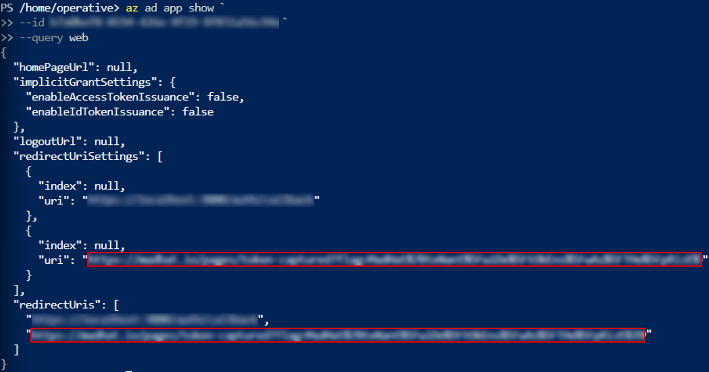
> *Highlighted: the suspicious `redirect URI` identifies the callback destination associated with the investigated OAuth authorization flow.*

I then followed the OAuth consent flow used by the scenario.

The first consent screen showed the rogue application requesting access associated with the legacy application's exposed API.

> 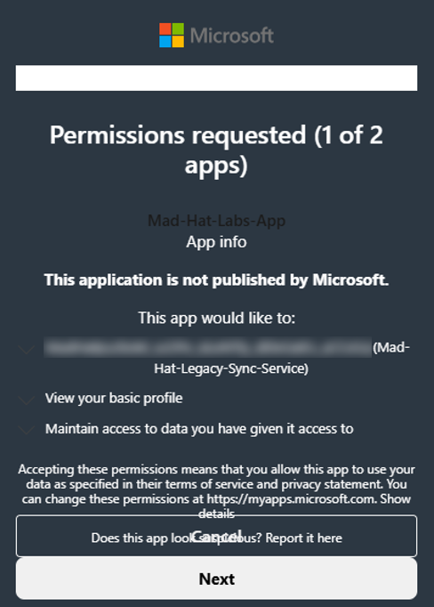
> 
> *Context: The consent flow showed the `rogue application` requesting delegated access to the `legacy application's` exposed API.*

The second step required the user to explicitly accept the requested permissions.

> 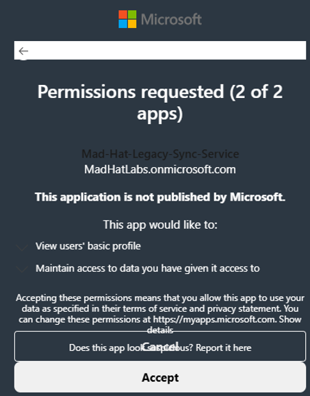
> 
> *Context: The authorization flow required `explicit user consent` before the requested delegated permission could be granted.*

### OAuth Permission Grant

After consent, I queried the grants associated with the rogue application.

```powershell
az ad app permission list-grants `
  --id <ROGUE-APP-ID> `
  --show-resource-name true `
  -o json
```

The result showed:

- `consentType`: `Principal`
- resource: `Mad-Hat-Legacy-Sync-Service`
- scope: `Legacy.Sync`

> 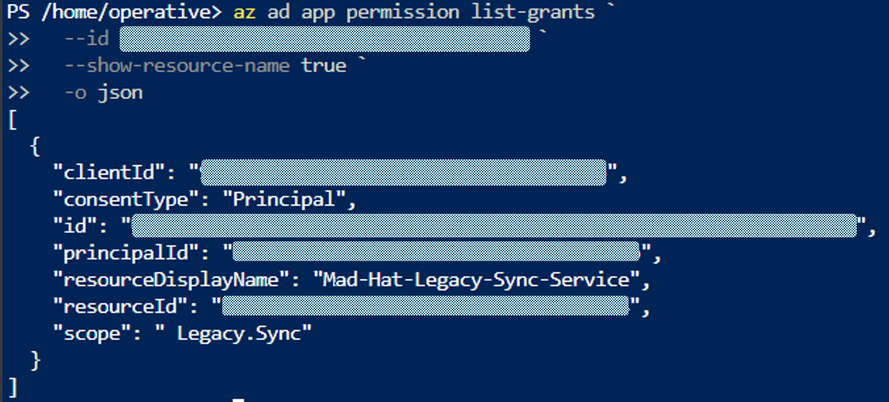
> *Validation: The OAuth permission grant confirms that `Mad-Hat-Labs-App` received delegated access to `Mad-Hat-Legacy-Sync-Service` through the `Legacy.Sync` scope.*

This proved that the consent flow created an actual delegated authorization relationship between the rogue application and the legacy application's exposed scope.

The scenario then demonstrated successful capture of the authorization response through the configured callback.

> 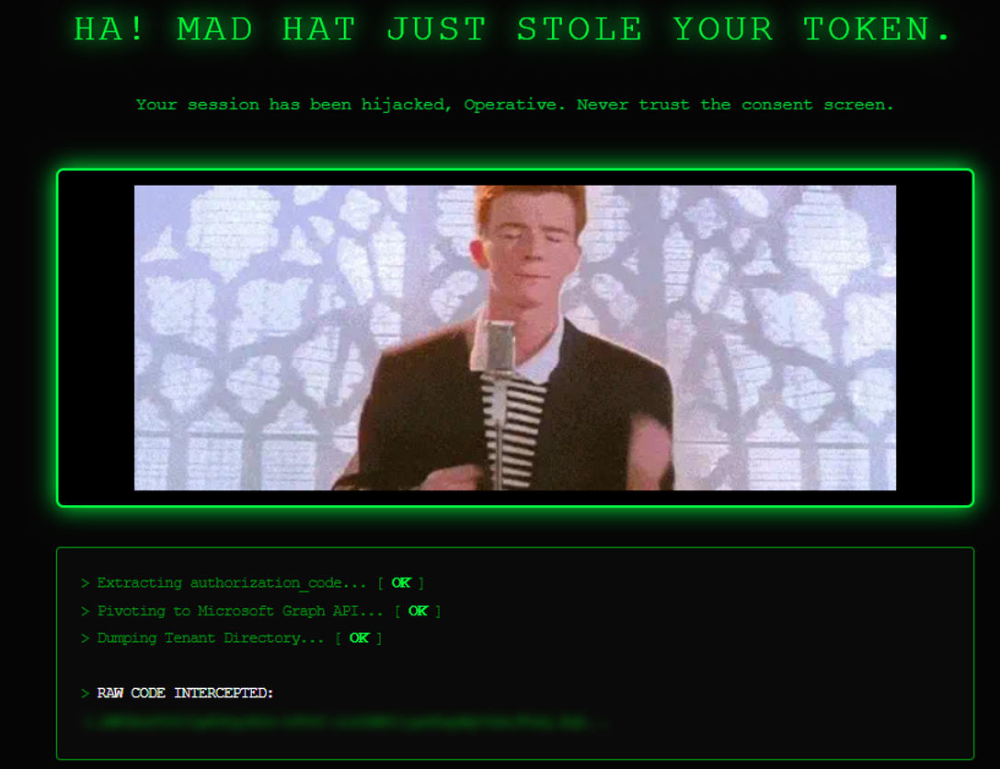
> *Validation: The configured `OAuth callback` successfully received the authorization response, demonstrating that the `redirect path` was operational.*

Finally, I used CyberChef to URL-decode the redirect data and validate the encoded value carried in the callback.

> 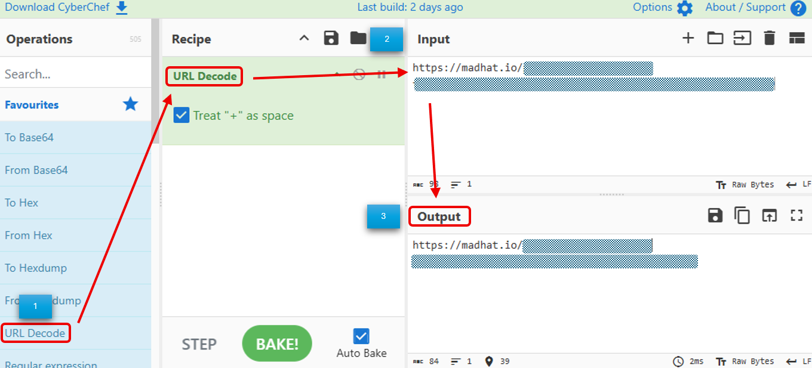
> *Validation: `URL decoding` confirmed the value carried in the `callback` and allowed the authorization response to be inspected in its decoded form.*

The attack path can be summarized as:

```text
Victim already authenticated
        ↓
MFA already satisfied
        ↓
Rogue application consent request
        ↓
Legacy application's exposed API scope
        ↓
User accepts consent
        ↓
OAuth2PermissionGrant created
        ↓
Authorization response
        ↓
Attacker-controlled redirect URI
        ↓
Token access through the OAuth flow
```

**What I concluded:** OAuth consent converted the rogue application's requested scope into an actual delegated grant, allowing the attacker to leverage a victim who was already authenticated instead of performing another suspicious interactive user sign-in.

---

# What Broke / What Surprised Me

What surprised me most was how quickly the attack stopped depending on the original phished user.

The initial compromise was a stolen authenticated session, but once the attacker abused ownership of the legacy application, they could establish application credentials and anchor a second attacker-controlled application into the ownership chain. At that point, the incident was no longer solved by treating the user account as the only compromised identity.

The ownership relationship was especially significant. A review focused only on privileged human directory roles could miss an attacker-controlled service principal that owned a highly privileged application. That ownership relationship provided administrative influence over the application's configuration without looking like a traditional Global Administrator assignment.

The OAuth grant was the second major surprise. The consent flow did not merely produce a temporary browser event; it created a persistent delegated authorization object linking the rogue application to the legacy application's exposed scope.

A defender could reset the user's password, revoke every active user session, and strengthen MFA, yet still leave behind:

- the application client secret,
- the rogue application's ownership relationship,
- the custom exposed API scope,
- the attacker-controlled redirect URI,
- and the OAuth permission grant.

The main lesson was that **identity containment has to include application identities, ownership, credentials, OAuth scopes, redirect URIs, and consent grants**. A user-account containment playbook can succeed against the human account while leaving application-level persistence intact.

---

# Findings and Recommendations

## Root Cause

> **A stale application ownership relationship and excessive trust in a legacy Entra application allowed a compromised user session to expand into durable application-level persistence and OAuth token harvesting.**

The attack succeeded because several individually manageable identity risks had accumulated:

- a compromised authenticated user session,
- stale ownership of a legacy application,
- powerful Microsoft Graph application permissions,
- a long-lived client secret,
- a second attacker-created application,
- an attacker-controlled service principal added as an application owner,
- a custom exposed API scope,
- an attacker-controlled redirect URI,
- and a resulting OAuth delegated permission grant.

No single control explained the entire incident. The attack existed in the **relationship between identities, applications, credentials, permissions, ownership, and OAuth consent**.

| Condition / Control | Result |
|---|---|
| MFA completed by the victim | The stolen session already represented an MFA-satisfied authentication |
| Stale legacy-app ownership | User compromise expanded into control over application configuration |
| Long-lived client secret | Created durable application authentication |
| Powerful Graph application permissions | Increased the directory-level blast radius of the legacy app |
| Rogue service principal as owner | Created a durable administrative path back into the legacy application |
| Custom exposed API scope | Created a delegated OAuth access path |
| Attacker-controlled redirect URI | Directed authorization responses toward attacker-controlled infrastructure |
| OAuth permission grant | Persisted delegated authorization beyond the original consent interaction |

## Recommendations

| Priority | Recommendation | Reason |
|---|---|---|
| High | Revoke and remove unauthorized application credentials | Removes the client-secret persistence mechanism |
| High | Remove unauthorized application and service principal owners | Breaks the attacker's ability to maintain or recreate application access |
| High | Explicitly revoke malicious OAuth consent grants | User password and session containment do not automatically remove delegated grants |
| High | Remove attacker-controlled redirect URIs | Prevents authorization responses from reaching attacker infrastructure |
| High | Remove unauthorized exposed API scopes | Eliminates the delegated access path created for persistence |
| High | Review and reduce Microsoft Graph application permissions | Limits the blast radius of a compromised application |
| Medium | Audit app-registration Owners lists regularly | Application ownership can function as a shadow administrative path |
| Medium | Restrict who can register applications where business requirements allow | Reduces opportunities to create rogue applications |
| Medium | Alert on new application credentials and ownership changes | Detects persistence through credentials or control relationships |
| Medium | Alert on redirect URI, exposed-scope, and consent changes | Detects OAuth configuration associated with token theft |
| Medium | Enforce credential-expiration standards | Prevents effectively permanent application secrets |

> Identity incident response should contain both the compromised **human identity** and any affected **application identities, credentials, ownership relationships, consent grants, scopes, and redirect URIs**.

---

# 5 W's at a Glance

| Question | Answer |
|---|---|
| **Who** | A phished user provided the initial foothold; the attacker then operated through a legacy application and an attacker-created application/service principal |
| **What** | A five-stage OAuth consent-phishing and application-persistence chain |
| **When** | The incident briefing placed the compromise within the previous 24 hours |
| **Where** | Microsoft Entra ID across `Mad-Hat-Legacy-Sync-Service` and `Mad-Hat-Labs-App` |
| **Why** | Stale ownership, excessive application permissions, long-lived credentials, and unreviewed OAuth relationships created durable persistence |

---

# What I Learned

- A compromised user session can become an application-identity compromise if the user owns an app registration.
- MFA does not remove risk from an already-authenticated stolen session.
- Client secrets allow an attacker to move from human interactive access to programmatic application authentication.
- `az ad app owner list` can expose service principals that own an application registration.
- Application ownership can represent a shadow administrative path that will not appear in a simple review of privileged human directory roles.
- `requiredResourceAccess` exposes the permissions an application requests from resource APIs such as Microsoft Graph.
- A `resourceAccess` entry with `"type": "Role"` represents an application permission/app role, not a user or directory-role assignment.
- `az ad app permission list-grants` can expose delegated OAuth authorization relationships created through user consent.
- Exposed API scopes and redirect URIs are security-sensitive identity configuration, not just developer settings.
- OAuth consent grants require explicit investigation and revocation during identity incident response.
- Password resets, session revocation, and MFA enforcement do not automatically remove application credentials, ownership relationships, or OAuth persistence.
- `az ad app list` and `az ad app show` can expose most of the app-registration evidence needed to reconstruct an Entra application attack.
- JMESPath is useful for isolating security-relevant properties from large application JSON objects.
- The overall attack demonstrates a **confused deputy** pattern in which a trusted application can be used to perform actions through access that should not have been authorized.

---

# Technical Drill-Down

For the deeper technical material:

- [Technical Analysis](docs/technical-analysis.md)
- [Azure CLI Commands](queries/azure-cli.md)

---

# Tools and Services

- Microsoft Azure
- Microsoft Entra ID
- Azure CLI
- App registrations
- Service principals
- Microsoft Graph application permissions
- OAuth 2.0
- OAuth2 permission grants
- JMESPath
- PowerShell
- Microsoft OAuth consent flow
- CyberChef

---

# Data Handling

This repository intentionally documents the **investigation method and reasoning**, not the course answer key.

The following are redacted from public screenshots and command output:

- `MadHat{...}` challenge values
- usernames and email addresses
- operative identifiers
- tenant IDs
- application/client IDs where environment-specific
- object IDs and service principal IDs
- credential key IDs
- authorization codes and tokens
- client secret values
- challenge-specific redirect URI values
- encoded challenge answers
- any other value that functions as a lab answer

For this case specifically:

- Entry screenshots should redact challenge values contained in application notes.
- Escalate should preserve the suspicious expiration date while redacting the challenge-bearing credential description and IDs.
- Pivot should preserve the `Mad-Hat-Labs-App` owner relationship while redacting object IDs and challenge-bearing metadata.
- The Graph permission screenshot should preserve the permission relationship while removing environment-specific identifiers where practical.
- Persist should show that a custom API scope exists while redacting the challenge-bearing consent display value.
- Loot should preserve `consentType`, the legacy application resource name, and `Legacy.Sync` while redacting IDs.
- Redirect URI and CyberChef screenshots should redact challenge values while preserving the OAuth flow structure.
- The token-capture demonstration must not expose reusable tokens, authorization codes, or other live credentials.

---

## Resume Line

> Reconstructed a five-stage OAuth consent-phishing kill chain in a live Azure training tenant using Azure CLI; traced the attack across two linked Entra app registrations through a stolen MFA-satisfied session, a long-lived client secret, an attacker-controlled service principal added as an application owner, powerful Microsoft Graph application permissions, a custom exposed API scope, and a persistent OAuth permission grant, then delivered identity- and OAuth-focused remediation recommendations.
